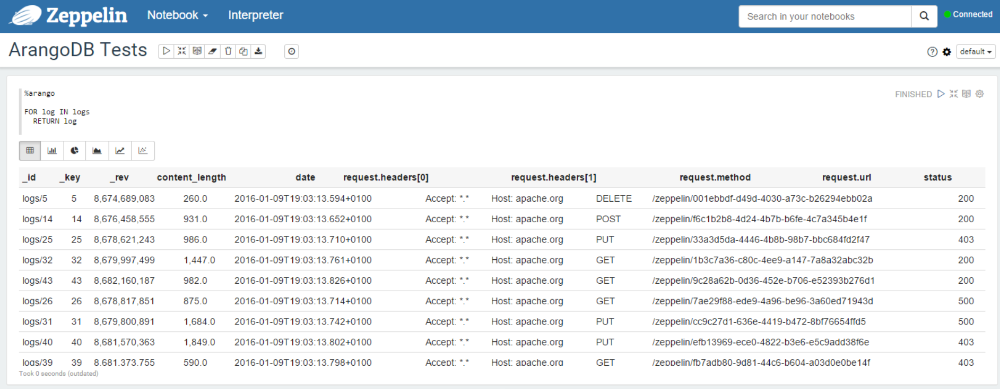
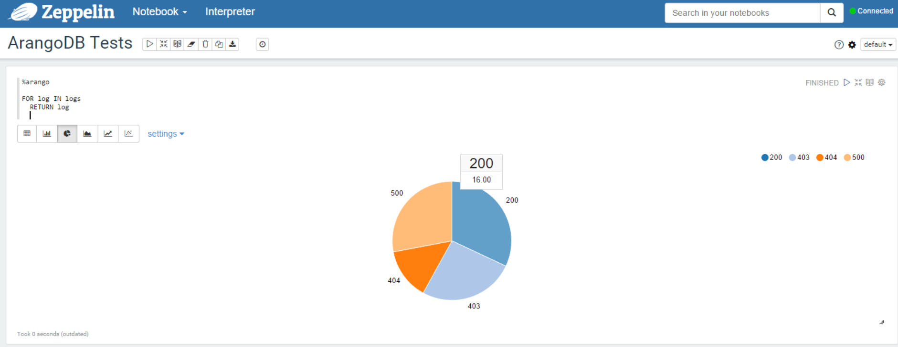
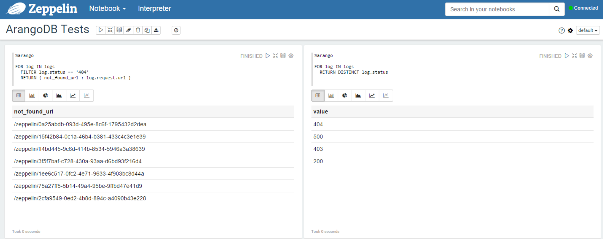

# zeppelin-arangodb-interpreter

[ArangoDB](https://www.arangodb.com/) Interpreter for [Apache Zeppelin](https://zeppelin.incubator.apache.org/).
This interpreter only supports AQL ([ArangoDB Query Language](https://docs.arangodb.com/Aql/)).

> **Important** : the graph part of ArangoDB is **PARTIALLY** supported at the moment. To test it, you can use the data from the [Actors and Movies Database example](https://docs.arangodb.com/cookbook/GraphExampleActorsAndMovies.html). 


## Versions

Interpreter | ArangoDB
------------|---------
2.0         | 3.x
1.0         | 2.7 

## Build
It's a Maven project, so it's simple:
```bash
mvn clean package
```
You should have a `arangodb-interpreter-jar-with-dependencies.jar` in the _target_ directory. 

## Install

`ZEPPELIN_HOME` is your Zeppelin installation directory.

* Create a directory  in <ZEPPELIN_HOME>/interpreter:
```bash
cd <ZEPPELIN_HOME>/interpreter
mkdir arangodb
```

* Copy the jar of arangodb-interpreter in the directory `<ZEPPELIN_HOME>/interpreter/arangodb.

* (optional, it is for older version of Zeppelin) In `<ZEPPELIN HOME>/conf/zeppelin-site.xml`, add the interpreter class:
```xml
<property>
  <name>zeppelin.interpreters</name>
  <value>io.millesabords.zeppelin.arangodb.ArangoDbInterpreter,org.apache.zeppelin.spark.SparkInterpreter,...</value>
  <description>Comma separated interpreter configurations. First interpreter become a default</description>
</property>
```

* Start Zeppelin:
On Linux:
```bash
<ZEPPELIN_HOME>/bin/zeppelin-daemon.sh start
```
or on Windows
```bash
<ZEPPELIN_HOME>\bin\zeppelin.cmd
```

## How to use the interpreter

### Configuration

First, you have to configure the interpreter by setting the values of:
* the host and port of your ArangoDB server
* the user/password
* the database name


### Commands

In a paragraph, use `%arango` to select the ArangoDB interpreter and then input all commands.

> **Important**: The result of a query can contain a list of JSON documents, so, as it is hierarchical (not flat as a row in a SQL table), for this interpreter, the result of a query is flattened.

Suppose we have a JSON document:

```
{
  "date": "2015-12-08T21:03:13.588Z",
  "request": {
    "method": "GET",
    "url": "/zeppelin/4cd001cd-c517-4fa9-b8e5-a06b8f4056c4",
    "headers": [ "Accept: *.*", "Host: apache.org"]
  },
  "status": "403",
  "content_length": 1234
}
```

The data will be flattened like this:


content_length | date | request.headers[0] | request.headers[1] | request.method | request.url | status
---------------|------|--------------------|--------------------|----------------|-------------|-------
1234 | 2015-12-08T21:03:13.588Z | Accept: \*.\* | Host: apache.org | GET | /zeppelin/4cd001cd-c517-4fa9-b8e5-a06b8f4056c4 | 403


### Examples :

* Document database :

```
| %arango
|
| FOR log in logs
|   RETURN log
|
```

  * The display as the table :




  * The display as a pie :




* Graph database :

```
| %arango
|
| FOR x IN actsIn COLLECT movie = x._to
|   WITH COUNT INTO counter
|   RETURN {movie: movie, nb_actors: counter}
|
```

<table>
  <tr><th>nb_actors</th><th>movie</th></tr>
  <tr><td>11.0</td><td>movies/AFewGoodMen</td></tr>
  <tr><td>4.0</td><td>movies/AsGoodAsItGets</td></tr>
  <tr><td>9.0</td><td>movies/JerryMaguire</td></tr>
  <tr><td>3.0</td><td>movies/JoeVersustheVolcano</td></tr>
  <tr><td>6.0</td><td>movies/SleeplessInSeattle</td></tr>
  <tr><td>4.0</td><td>movies/SnowFallingonCedars</td></tr>
</table>


* Other examples :




